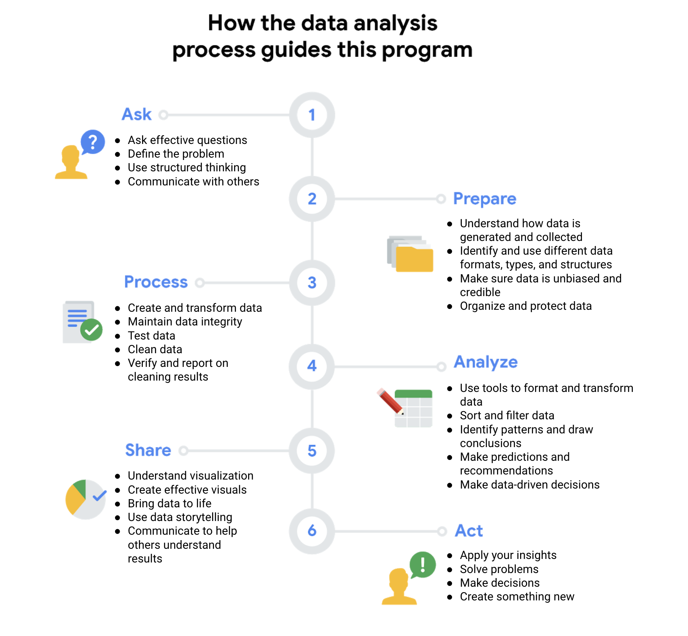

# Data Analytics-Google

## Data

a collection of data or facts.

## Data Analysis

It is a collection ,transformation and organization of data in order to draw conclusions, make predictions and drive informed-decision making.

## Data Analytics

Someone who collects ,transforms and organizes data in order to help make informed decisions.

It is the science of Data

### Different properties of data analytics

Ask, prepare, process, share and act.

Data! Data! data...I can't make bricks without clay. - by sherlock holmes

## TRANSFORMING DATA INTO INSIGHTS

Businesses need a way to control all that data so they can use it to improve processes, identify opportunities and trends, launch new products, serve customers, and make thoughtful decisions.

## People Analytics

also known as human resources analytics or workforce analytics. People analytics is the practice of collecting and analyzing data on the people who make up a company’s workforce in order to gain insights to improve how the company operates.

### Processes of data analysis

1. Ask
2. Prepare
3. Process
4. Analyze
5. Share
6. Act

The analysts **asked** questions to define both the issue to be solved and what would equal a successful result.

&#x20;Next, they **prepared** by building a timeline and collecting data with employee surveys that were designed to be inclusive.&#x20;

They **processed** the data by cleaning it to make sure it was complete, correct, relevant, and free of errors and outliers.

&#x20;They **analyzed** the clean employee survey data.&#x20;

Then the analysts **shared** their findings and recommendations with team leaders.&#x20;

Afterward, leadership **acted** on the results and focused on improving key areas.&#x20;

## Data Analyists

A data analyst is an explorer, a detective, and an artist all rolled into one. Analytics is the quest for inspiration

Data science is the discipline of making data useful, is an umbrella term that encompasses three disciplines: machine learning, statistics, and analytics.

## Ecosystem

an ecosystem is a group of elements that interact with one another.

Data ecosystems are made up of various elements that interact with one another in order to produce, manage, store, organize, analyze, and share data. These elements include hardware and software tools, and the people who use them. People like you. Data can also be found in something called the cloud. The cloud is a place to keep data online, rather than on a computer hard drive. So instead of storing data somewhere inside your organization's network, that data is accessed over the internet. So the cloud is just a term we use to describe the virtual location. The cloud plays a big part in the data ecosystem, and as a data analyst, it's your job to harness the power of that data ecosystem, find the right information, and provide the team with analysis that helps them make smart decisions.

## Data Science

Data science is defined as creating new ways of modeling and understanding the unknown by using raw data.

## Data and gut instinct

1. **Ask** questions and define the problem.
2. **Prepare** data by collecting and storing the information.
3. **Process** data by cleaning and checking the information.
4. **Analyze** data to find patterns, relationships, and trends.
5. **Share** data with your audience.
6. **Act** on the data and use the analysis results.





**Gut instinct** is an intuitive understanding of something with little or no explanation. This isn’t always something conscious; we often pick up on signals without even realizing. You just have a “feeling” it’s right.

### Data + business knowledge = mystery solved

1. **Ask**: Business Challenge/Objective/Question
2. **Prepare**: Data generation, collection, storage, and data management
3. **Process**: Data cleaning/data integrity
4. **Analyze**: Data exploration, visualization, and analysis
5. **Share**: Communicating and interpreting results&#x20;
6. **Act**:  Putting your insights to work to solve the problem

### EMC's data analysis life cycle

EMC Corporation's data analytics life cycle is cyclical with six steps:

1. Discovery
2. Pre-processing data
3. Model planning
4. Model building
5. Communicate results
6. Operationalize

### SAS's iterative life cycle

An iterative life cycle was created by a company called **SAS**, a leading data analytics solutions provider. It can be used to produce repeatable, reliable, and predictive results:

1. Ask
2. Prepare
3. Explore
4. Model
5. Implement
6. Act
7. Evaluate

The SAS model emphasizes the cyclical nature of their model by visualizing it as an infinity symbol. Their life cycle has seven steps, many of which we have seen in the other models, like Ask, Prepare, Model, and Act. But this life cycle is also a little different; it includes a step after the act phase designed to help analysts evaluate their solutions and potentially return to the ask phase again.&#x20;

### Project-based data analytics life cycle

A project-based data analytics life cycle has five simple steps:

1. Identifying the problem
2. Designing data requirements
3. Pre-processing data
4. Performing data analysis
5. Visualizing data

### Big data analytics life cycle

Authors Thomas Erl, Wajid Khattak, and Paul Buhler proposed a big data analytics life cycle in their book, **Big Data Fundamentals: Concepts, Drivers & Techniques**. Their life cycle suggests phases divided into nine steps:

1. Business case evaluation
2. Data identification
3. Data acquisition and filtering
4. Data extraction
5. Data validation and cleaning
6. Data aggregation and representation
7. Data analysis
8. Data visualization
9. Utilization of analysis results

## Analytics Skill

Analytical skills are qualities and characteristics associated with solving problems using facts.

#### Context

&#x20;is the condition in which something exists or happens. This can be a structure or an environment

#### A technical mindset&#x20;

involves the ability to break things down into smaller steps or pieces and work with them in an orderly and logical way.

#### Data Design

how you organize information

#### Data Strategy

Data strategy is the management of the people, processes, and tools used in data analysis.

### Analytical Thinking

Analytical thinking involves identifying and defining a problem and then solving it by using data in an organized, step-by-step manner.

The five key aspects to analytical thinking. They are visualization, strategy, problem-orientation, correlation, and finally, big-picture and detail-oriented thinking.

In data analytics, visualization is the graphical representation of information. Some examples include graphs, maps, or other design elements.

Strategizing helps data analysts see what they want to achieve with the data and how they can get there. Strategy also helps improve the quality and usefulness of the data we collect.

Data analysts use a problem- oriented approach in order to identify, describe, and solve problems.

#### What is the root cause of a problem?&#x20;

A root cause is the reason why a problem occurs.

A simple way to wrap your head around root causes is with the process called the Five Whys. In the Five Whys you ask "why" five times to reveal the root cause. The fifth and final answer should give you some useful and sometimes surprising insights.

### Gap Ananlysis

Gap analysis lets you examine and evaluate how a process works currently in order to get where you want to be in the future. Businesses conduct gap analysis to do all kinds of things, such as improve a product or become more efficient. The general approach to gap analysis is understanding where you are now compared to where you want to be.

### Data- driven decision-making

Using facts to guide business strategy.

### Non Profit

Nonprofits are organizations dedicated to advancing a social cause or advocating for a particular effort, such as food security, education or the arts.

## STAGES OF THE DATA LIFE CYCLE

The life cycle of data is plan, capture, manage, analyze, archive and destroy.

a) During planning, a business decides what kind of data it needs, how it will be managed throughout its life cycle, who will be responsible for it, and the optimal outcomes.

b) capture data. This is where data is collected from a variety of different sources and brought into the organization.

A database is a collection of data stored in a computer system.

c) Manage- It is about how we care for our data, how and where it's stored, the tools used to keep it safe and secure, and the actions taken to make sure that it's maintained properly. This phase is very important to data cleansing.

d) Analyze- In this phase, the data is used to solve problems, make great decisions, and support business goals.

e)Archive- Archiving means storing data in a place where it's still available, but may not be used again.

f)Destroy- This is important for protecting a company's private information, as well as private data about its customers.

### Variations of the data life cycle

1. **Plan:** Decide what kind of data is needed, how it will be managed, and who will be responsible for it.
2. **Capture:** Collect or bring in data from a variety of different sources.
3. **Manage:** Care for and maintain the data. This includes determining how and where it is stored and the tools used to do so.
4. **Analyze:** Use the data to solve problems, make decisions, and support business goals.
5. **Archive:** Keep relevant data stored for long-term and future reference.
6. **Destroy:** Remove data from storage and delete any shared copies of the data.

## Six phases of data analysis

Stakeholders hold a stake in the project. They are people who have invested time and resources into a project and are interested in the outcome.&#x20;

a) First, defining a problem means you look at the current state and identify how it's different from the ideal state. Another important part of the ask phase is understanding stakeholder expectations. The first step here is to determine who the stakeholders are.

b) the prepare step of the data analysis process. This is where data analysts collect and store data they'll use for the upcoming analysis process.In other words, any decisions made from your analysis should always be based on facts and be fair and impartial.

c) Process step -data analysts find and eliminate any errors and inaccuracies that can get in the way of results. This usually means cleaning data, transforming it into a more useful format, combining two or more datasets to make information more complete and removing outliers, which are any data points that could skew the information

d) Analyze step- Analyzing the data you've collected involves using tools to transform and organize that information so that you can draw useful conclusions, make predictions, and drive informed decision-making. There are lots of powerful tools data analysts use in their work and in this course you'll learn about two of them, spreadsheets and structured query language, or SQL, which is often pronounced "sequel".

e) Share phase- data analysts interpret results and share them with others to help stakeholders make effective data-driven decisions. In the share phase, visualization is a data analyst's best friend.

f)Act - This is when you prepare for your job search and have the chance to complete a case study project.

<figure><figcaption></figcaption></figure>

### Tools used by data analyst

The most common ones you'll see analyst use are spreadsheets, query languages and visualization tools.

#### a) Spreadsheets

There are lots of different spreadsheet solutions, but two popular options are Microsoft Excel and Google Sheets.

A spreadsheet is a digital worksheet. It stores, organizes, and sorts data.

Spreadsheets also have some really useful features called formulas and functions. A **formula** is a set of instructions that performs a specific calculation using the data in a spreadsheet. Formulas can do basic things like add, subtract, multiply and divide, but they don't stop there.

A **function** is a preset command that automatically performs a specific process or task using the data in a spreadsheet.

#### b) Query Language

A query language is a computer programming language that allows you to retrieve and manipulate data from a database.

**SQL -** SQL is a language that lets data analysts communicate with a database. A database is a collection of data stored in a computer system. SQL is the most widely used structured query language for a couple of reasons.

**c) Data Visualization**

Data visualization is the graphical representation of information. Some examples include graphs, maps, and tables. Most people process visuals more easily than words alone.&#x20;

Some popular visualization tools are Tableau and Looker.

Data analysts like using **Tableau** because it helps them create visuals that are very easy to understand. This means that even non-technical users can get the information they need. **Looker** is also popular with data analysts because it gives them an easy way to create visuals based on the results of a query. With Looker, you can give stakeholders a complete picture of your work by showing them visualization data and the actual data related to it.&#x20;

### Spreadsheets

Data analysts rely on spreadsheets to collect and organize data. Two popular spreadsheet applications you will probably use a lot in your future role as a data analyst are Microsoft Excel and Google Sheets.

Spreadsheets structure data in a meaningful way by letting you

* Collect, store, organize, and sort information
* Identify patterns and piece the data together in a way that works for each specific data project
* Create excellent data visualizations, like graphs and charts.

### Databases and query languages

A database is a collection of structured data stored in a computer system. Some popular Structured Query Language (SQL) programs include MySQL, Microsoft SQL Server, and BigQuery.

Query languages

* Allow analysts to isolate specific information from a database(s)
* Make it easier for you to learn and understand the requests made to databases
* Allow analysts to select, create, add, or download data from a database for analysis

### Visualization tools

Data analysts use a number of visualization tools, like graphs, maps, tables, charts, and more. Two popular visualization tools are Tableau and Looker.

These tools

* Turn complex numbers into a story that people can understand
* Help stakeholders come up with conclusions that lead to informed decisions and effective business strategies
* Have multiple features

\- **Tableau**'s simple drag-and-drop feature lets users create interactive graphs in dashboards and worksheets

\- **Looker** communicates directly with a database, allowing you to connect your data right to the visual tool you choose

| Spreadsheets                               | Databases                                                |
| ------------------------------------------ | -------------------------------------------------------- |
| Software applications                      | Data stores - accessed using a query language (e.g. SQL) |
| Structure data in a row and column format  | Structure data using rules and relationships             |
| Organize information in cells              | Organize information in complex collections              |
| Provide access to a limited amount of data | Provide access to huge amounts of data                   |
| Manual data entry                          | Strict and consistent data entry                         |
| Generally one user at a time               | Multiple users                                           |
| Controlled by the user                     | Controlled by a database management system               |

#### What is the relationship between the data life cycle and the data analysis process? How are the two processes similar? How are they different?

While the data analysis process will drive your projects and help you reach your business goals, you must understand the life cycle of your data in order to use that process. To analyze your data well, you need to have a thorough understanding of it. Similarly, you can collect all the data you want, but the data is only useful to you if you have a plan for analyzing it.

#### What is the relationship between the Ask phase of the data analysis process and the Plan phase of the data life cycle? How are they similar? How are they different?

The Plan and Ask phases both involve planning and asking questions, but they tackle different subjects. The Ask phase in the data analysis process focuses on big-picture strategic thinking about business goals. However, the Plan phase focuses on the fundamentals of the project, such as what data you have access to, what data you need, and where you’re going to get it.

#### 1.

Question 1

Fill in the blank: A business is determining who should be responsible for the data in their current data analysis project. This means that the company is in the \_\_\_\_\_\_ stage of the data life cycle.

1 / 1 point

analyze

plan

manage

capture

Correct

#### 2.

Question 2

A data analyst is working at a small tech startup. They’ve just completed an analysis project, which involved private company information about a new product launch. In order to keep the information safe, the analyst uses secure data-erasure software for the digital files and a shredder for the paper files. Which state of the data life cycle does this describe?

1 / 1 point

Plan

Manage

Archive

Destroy

Correct

#### 3.

Question 3

A data analyst is working at a small tech startup. On their current project they are in the analyze stage of the data life cycle. What might they do in this stage?

1 / 1 point

Determine who is responsible for managing the data

Choose the format of their spreadsheet headings

Use a formula to perform calculations

Validate the insights provided by analysts

Correct

#### 4.

Question 4

Describe how the data life cycle differs from data analysis.

1 / 1 point

The data life cycle deals with the stages that data goes through during its useful life; data analysis is the process of analyzing data.

The data life cycle deals with identifying the best data to solve a problem; data analysis is about asking effective questions.

The data life cycle deals with transforming and verifying data; data analysis is using the insights gained from the data.

The data life cycle deals with making informed decisions; data analysis is using tools to transform data.

Correct

#### 5.

Question 5

What actions might a data analytics team take in the act phase of the data analysis process? Select all that apply.

1 / 1 point

Finalizing a strategy based on the analysis

Correct

Validating insights provided by analysts

Correct

Sharing analysis results using data visualization

Putting a plan into action to help solve the original business problem

Correct

#### 6.

Question 6

In data analysis, a function is a predefined operation whereas a formula is a set of instructions used to carry out a specific calculation.

1 / 1 point

True

False

Correct

#### 7.

Question 7

Fill in the blank: A query is used to \_\_\_\_\_ information from a database. Select all that apply.

1 / 1 point

visualize

retrieve

Correct

update

Correct

request

Correct

#### 8.

Question 8

Why is SQL the most popular structured query language? Select all that apply.

1 / 1 point

SQL is the most secure database on the market

SQL works with a wide variety of databases

Correct

SQL is easy to understand

Correct

SQL allows data analysts to use spreadsheets

## Mastering Spreadsheet basics

Column names are attributes.

**Attributes** - An attribute is a characteristic or quality of data used to label a column in a table. More commonly, attributes are referred to as column names, column labels, headers, or the header row.

**Observation -** In a dataset, a row is also called an observation. An observation includes all of the attributes for something contained in a row of a data table.

**Formula -** Formulas are like a calculator, but more powerful. A formula is a set of instructions that performs a specific action using the data in a spreadsheet. To do this, the formula uses cell references for the values it's calculating.

